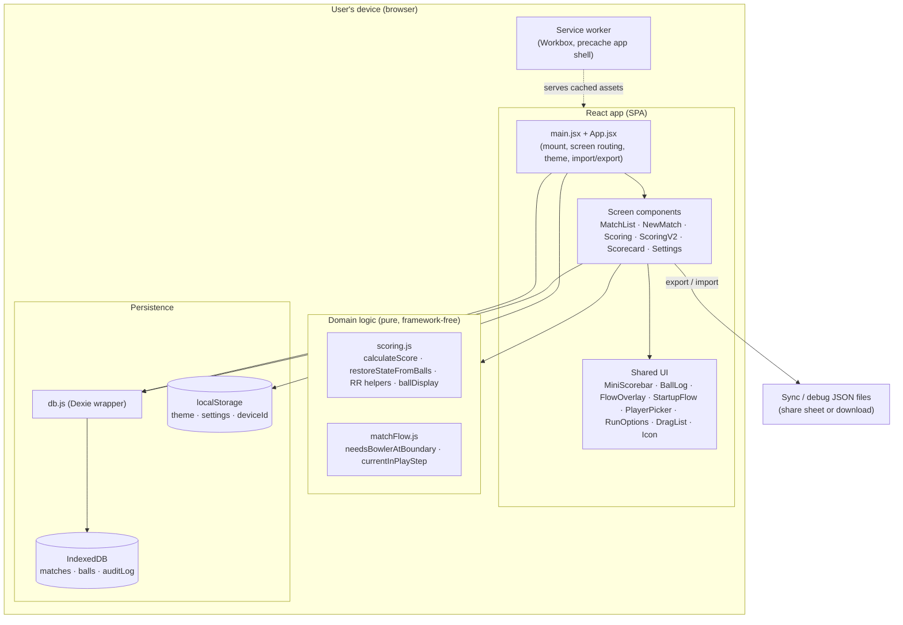
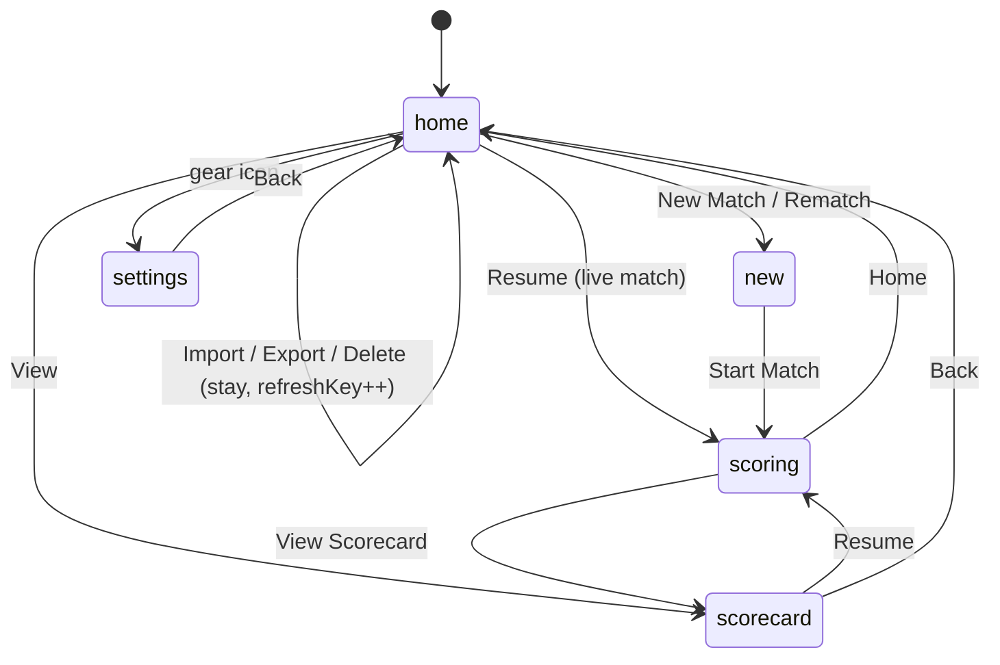
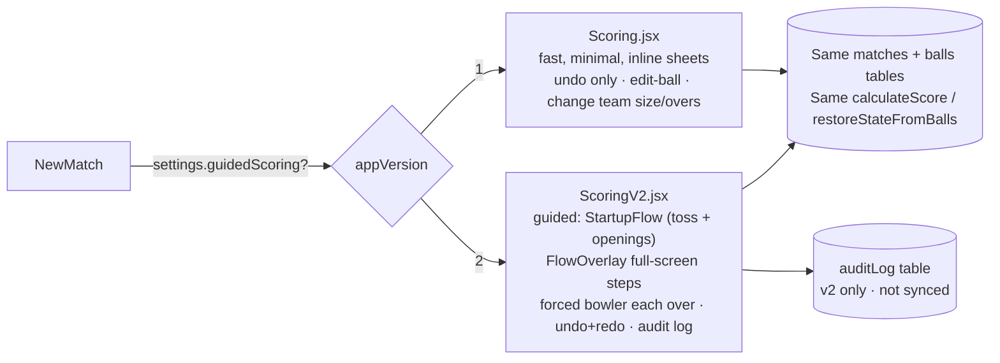

# Architecture

## Overview

Box Cricket is a **client-only, offline-first single-page PWA**. There is no server, no API,
and no network dependency for its core function. Everything runs in the browser: React
renders the UI, pure JavaScript computes the scoring, and Dexie (IndexedDB) persists data on
the device. Data leaves the device only when the user explicitly exports a sync file.



Key properties:

- **No router / no global store.** `App.jsx` is a single stateful component. "Navigation" is
  a `screen` string in React state (`'home' | 'new' | 'scoring' | 'scorecard' | 'settings'`),
  and data flows down by props. There is no Redux/Context store; the database *is* the shared
  state, and components read/write it directly through `db.js`.
- **Domain logic is pure and isolated.** `scoring.js` and `matchFlow.js` import nothing from
  React or Dexie. They take plain arrays/objects and return plain values, which is why they
  can be exhaustively unit-tested and reused by both scoring screens.

## The re-derivation data flow (the heart of the app)

Scoring never mutates a running total. Each action writes/removes a ball, then the screen
re-reads the ball log and recomputes everything.

```mermaid
sequenceDiagram
  participant U as User
  participant S as Scoring screen
  participant DB as db.js (Dexie)
  participant SC as scoring.js (pure)

  U->>S: tap a run / extra / wicket
  S->>DB: addBall(ball)  // append one immutable delivery
  DB-->>S: ballId
  S->>DB: getBalls(matchId, innings)  // re-read the full log
  DB-->>S: balls[]
  S->>SC: calculateScore(balls) + restoreStateFromBalls(balls)
  SC-->>S: {runs, wickets, batsmen, bowlers} + {striker, nonStriker, bowlerIdx}
  S->>S: re-render from derived values; check innings/match end
  Note over S,DB: Undo = removeLastBall then re-derive.<br/>Edit = updateBall/deleteBall then re-derive.<br/>Resume = getBalls then re-derive from scratch.
```

**Why this matters for changes:** a scoring bug is almost always either (a) a wrong rule in
the pure functions, or (b) a wrong *shape* of the stored ball (e.g. missing `tapRuns`,
wrong `extraType`). It is almost never a stale counter, because there are no counters. Fix
rules in `scoring.js`; fix data shape at the `recordBall` call site in the screen.

## Screen / navigation state machine



`App.jsx` holds `screen`, `matchId`, `matchVersion`, `rematchFrom`, `refreshKey`, and import
state. `refreshKey` is bumped to force `MatchList` to re-query after a mutation (a lightweight
substitute for a subscription/observable).

## v1 vs v2 scoring (one data model, two experiences)

Both scoring screens read and write the **same** `matches`/`balls` tables and use the **same**
`scoring.js` derivation. They differ only in UI flow.



- The choice is made **per match at creation**: `App.jsx` passes `appVersion = settings.guidedScoring ? 2 : 1`
  to `NewMatch`; `createMatch` (v1) vs `createMatchV2` (v2) stamps `match.appVersion`.
- **Existing matches keep their version.** `openScoring` reads `match.appVersion` and routes
  to the right component, so flipping the global setting never changes a match already in
  progress.
- `matchFlow.js` sequences v2's in-play prompts (`currentInPlayStep` priority: wicket →
  new batsman → bowler; `needsBowlerAtBoundary` gates the forced-bowler pick). `StartupFlow`
  + `FlowOverlay` render the pre-match and step overlays. `settings.js`'s sub-toggles
  (`toss`, `openingBatsmen`, `forceBowlerEachOver`, `detailedWicket`, `undoRedo`,
  `homeButton`, `auditLog`) each gate a slice of v2 behavior and only apply when
  `guidedScoring` is on.

## Persistence & device state

- **IndexedDB (via Dexie)** holds durable match data: `matches`, `balls`, and (v2) `auditLog`.
  See [data-model.md](data-model.md).
- **localStorage** holds small device-scoped preferences: `boxCricketTheme`,
  `boxCricketSettings`, and `boxCricketDeviceId` (a stable per-device id used for sync
  provenance). All reads/writes are wrapped in try/catch because storage can be unavailable
  (private mode, SSR/tests).

## Testing architecture

- Pure logic: `scoring.test.js`, `matchFlow.test.js` — plain function assertions.
- Persistence: `db.test.js`, `db.v2.test.js` — run against `fake-indexeddb`.
- Components: `*.test.jsx` — React Testing Library + jsdom, driving real user flows.
- Config in `vite.config.js` (`test` block): jsdom env, global APIs, `retry: 2` for a few
  timing-sensitive legacy component tests, v8 coverage. CLAUDE.md requires ≥80% statements.
