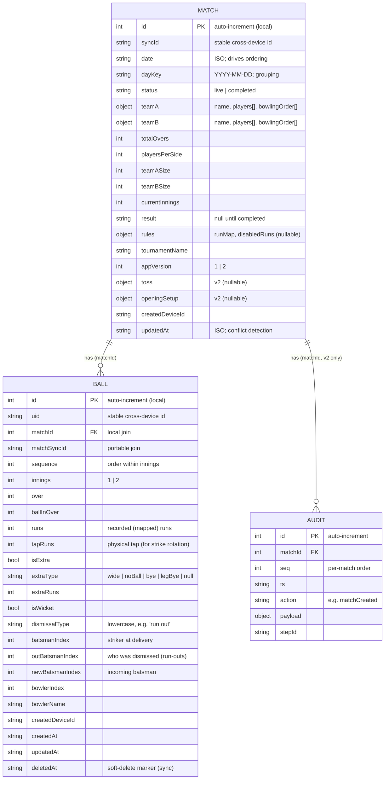

# Data Model

All durable data lives in a single IndexedDB database, **`BoxCricketDB`**, accessed through
Dexie in `src/db.js`. Small device preferences (theme, settings, device id) live in
localStorage and are not part of this model.

## Schema versions (Dexie)

```js
// v1
db.version(1).stores({
  matches: '++id, date, status',
  balls:   '++id, matchId, innings, over, ballInOver',
});
// v2 — adds the guided-scoring audit log
db.version(2).stores({
  matches:  '++id, date, status',
  balls:    '++id, matchId, innings, over, ballInOver',
  auditLog: '++id, matchId, seq',
});
```

The store strings declare **indexed** fields only (`++id` = auto-increment primary key). Every
other field on a record is a plain unindexed property and can be added without a schema bump —
this is why new fields are introduced with `??` defaults rather than migrations.

## Entity relationships



## `matches`

Created by `createMatch` / `createMatchV2`; every record is passed through
`withMatchSyncFields` which fills sync/identity/backward-compat defaults.

| Field | Notes |
|---|---|
| `id` | Local auto-increment PK. **Not** portable — sync uses `syncId`. |
| `syncId` | Stable id (`match_<uuid>`) that survives export/import; the real cross-device identity. |
| `sourceSyncId` | Set on an "import copy" to remember the origin match. |
| `date` / `dayKey` | ISO timestamp and its `YYYY-MM-DD` day; `dayKey` drives MatchList day-grouping and is recomputed whenever `date` changes (`updateMatch`). |
| `status` | `'live'` (resumable) or `'completed'` (result set). Indexed. |
| `teamA` / `teamB` | `{ name, players: string[], bowlingOrder: number[]|string[] }`. Player names optional; indices are the stable references in balls. |
| `totalOvers`, `playersPerSide` | Match limits from NewMatch. |
| `teamASize` / `teamBSize` | Per-team sizes (v1 can change mid-match). Read as `match.teamASize ?? match.playersPerSide` for old records. |
| `currentInnings` | `1` or `2`. |
| `result` | Human-readable result string, set by `endMatch`; `null` while live. |
| `rules` | Custom scoring: `{ runMap: {tap: recorded}, disabledRuns: number[] }` or `null`. See `docs/testing/10-custom-scoring-rules-outcomes.md`. |
| `tournamentName` | Optional; groups matches across days in MatchList. |
| `appVersion` | `1` (Scoring) or `2` (ScoringV2). Chosen at creation, immutable thereafter. |
| `toss`, `openingSetup` | v2 guided pre-match state (who won toss, elected bat/bowl, opening batsmen/bowler). `null` for v1. |
| `createdDeviceId`, `updatedAt` | Provenance + last-change time (used for import conflict detection). |

## `balls`

One immutable-ish record per delivery. Written by `addBall`; state is always re-derived from
the ordered set (`getBalls` sorts by `id`). See
`docs/testing/07-domain-ball-outcomes.md` for the full outcome semantics.

Load-bearing fields for correctness:

- **`runs` vs `tapRuns`** — `runs` is the *recorded* value that counts toward the score
  (after any `runMap`); `tapRuns` is the *physical* value the scorer tapped and is what
  strike-rotation parity is computed from. With no custom rules they're equal. Losing
  `tapRuns` silently breaks rotation under custom rules.
- **`isExtra` + `extraType`** — decide legality (wide/noBall are illegal deliveries; bye/legBye
  are legal) and which extras bucket the runs land in.
- **`isWicket` + `dismissalType`** — `dismissalType` is stored lowercase; membership in
  `BOWLER_CREDITED_DISMISSALS` decides bowler wicket credit. `null` means legacy/bowler-credited.
- **`batsmanIndex` / `outBatsmanIndex` / `newBatsmanIndex`** — striker at the delivery, who was
  actually dismissed (run-outs can be the non-striker), and the persisted incoming batsman so
  a resume reconstructs the crease correctly.
- **`bowlerIndex` / `bowlerName`** — bowler stats key by name when present (unifies multi-spell
  rows), else by index.
- Sync fields (`uid`, `matchSyncId`, `sequence`, `createdDeviceId`, timestamps, `deletedAt`).

## `auditLog` (v2 only)

Append-only, per-match ordered event log (`seq` assigned per match by `appendAudit`). Records
every mutation so a v2 match can be replayed for support/debugging (`utils/debug.js`
`replayBallsFromAudit`). **Deliberately excluded from the sync/export path** — it is a local
diagnostic artifact only. Cascade-deleted with its match (`deleteMatch` → balls + audit).

## Backward-compatibility conventions

- **New non-indexed field → default on read with `??`**, never a migration. Canonical example:
  `match.teamASize ?? match.playersPerSide`. `withMatchSyncFields` / `withBallSyncFields`
  centralize these defaults so any record loaded or imported is normalized.
- **Only bump the Dexie version to add/modify an index or store** (as v2 did for `auditLog`).
- Ball records from before `tapRuns` existed fall back to `runs`; before `newBatsmanIndex`,
  `restoreStateFromBalls` self-heals from `batsmanIndex`. Preserve these fallbacks when editing.

## CRUD entry points (`db.js`)

`createMatch` / `createMatchV2` / `getMatch` / `getAllMatches` / `updateMatch`;
`addBall` / `getBalls` / `removeLastBall` / `deleteBall` / `updateBall` / `getBallById` /
`deleteBallsForMatch`; `appendAudit` / `getAuditLog` / `deleteAuditLog`;
`deleteMatch` / `deleteMatchesByDay` / `deleteMatchesByTournament`. Any write that mutates a
match's balls also calls `updateMatch(matchId, {})` to bump `updatedAt`.
