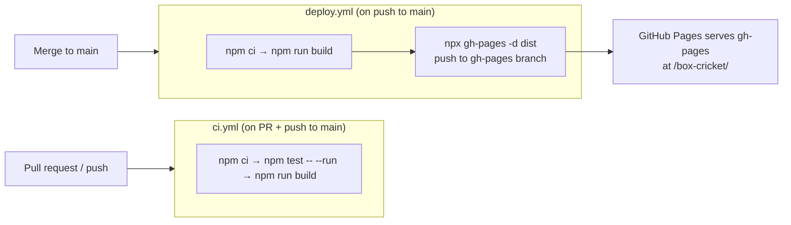

# Deployment

## Local development

```bash
npm install        # install deps
npm run dev        # Vite dev server (HMR)
npm test           # vitest run (watch: npm run test:watch)
npm run test:coverage   # v8 coverage; CLAUDE.md requires >=80% statements
npm run lint       # eslint
npm run build      # production build into dist/
npm run preview    # serve the built dist/ locally
```

Node 20 is used in CI; match it locally.

## Build & hosting model

- **Bundler**: Vite 7 (`vite build` → static assets in `dist/`).
- **Base path**: `base: '/box-cricket/'` in `vite.config.js`. The app is served from a
  sub-path (`https://<user>.github.io/box-cricket/`), so all asset URLs and the PWA
  `start_url` are prefixed with `/box-cricket/`. **If the hosting path ever changes, this
  base and the manifest `start_url`/icon paths must change together.**
- **Host**: GitHub Pages, serving the `gh-pages` branch. Purely static — no server runtime.

## PWA / offline

Configured via `vite-plugin-pwa` (Workbox) in `vite.config.js`:

- `registerType: 'autoUpdate'` — the service worker precaches the built app shell and
  **auto-updates** on the next load after a new deploy. There is **no** in-app "update
  available" prompt (`useRegisterSW`/needRefresh is not wired up) — a known gap noted in
  `docs/testing/06-scorecard-sharing-and-pwa.md`.
- **Manifest**: standalone display, portrait, theme `#1a472a`, background `#f5f5f0`,
  `start_url: /box-cricket/`, 192/512 icons (512 is `any maskable`). `App.jsx` overrides the
  live `theme-color` meta to match the selected palette.
- **Offline scope**: the app shell and assets are cached; all match data is already local
  (IndexedDB), so scoring works fully offline after the first successful load. There is no
  online/offline indicator in the UI.

## CI/CD pipeline



**`ci.yml`** (`.github/workflows/ci.yml`) — runs on every pull request and on pushes to
`main`: installs, runs the full test suite (`npm test -- --run`), and builds. This is the gate
for merging.

**`deploy.yml`** (`.github/workflows/deploy.yml`) — runs on push to `main` (i.e. after a PR
merges) and on manual `workflow_dispatch`. Builds and publishes `dist/` to the `gh-pages`
branch using the `gh-pages` npm tool, authenticating with the built-in `GITHUB_TOKEN` via an
`x-access-token` remote URL. `concurrency: pages-deploy` with `cancel-in-progress` ensures the
newest deploy wins. The commit message carries `[skip ci]` so publishing doesn't retrigger CI.

Notes for changes:
- The deploy commits as `github-actions[bot]`; the `-u` flag was intentionally dropped because
  the bracketed bot name is unparseable by `gh-pages` (see git history — two follow-up fixes).
- `permissions: contents: write` is required for the token to push to `gh-pages`.

## Release flow (practical)

1. Branch off `main`, make the change **with tests**, keep `npm test` green and coverage ≥80%.
2. Open a PR → `ci.yml` must pass.
3. Merge → `deploy.yml` builds and publishes to `gh-pages` → Pages serves it, and installed
   PWAs pick up the new service worker on their next launch.
