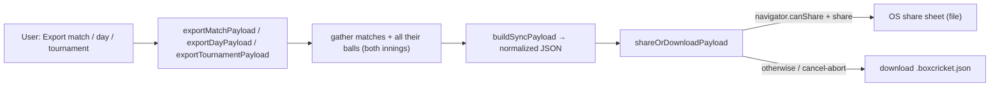
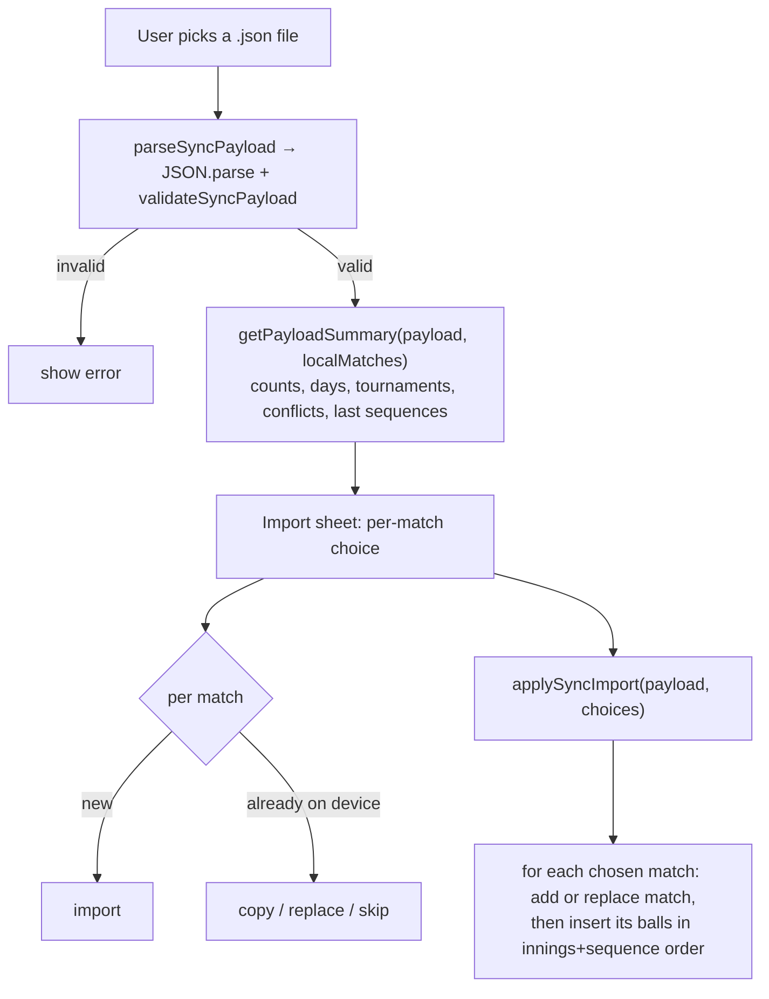
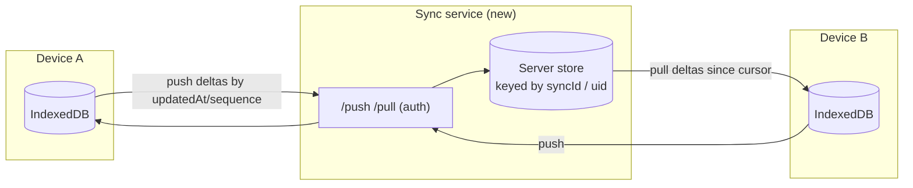

# Sync, Import & Export

There is no server. "Sync" today means **manually moving a JSON file between devices** via the
Web Share API (or a download). The data model was deliberately built with stable ids,
per-innings sequence numbers, device provenance, and soft-delete markers so that an
**automatic online sync** can be added later without changing the on-device schema. This
document covers both the current file-based flow and how to extend it.

All logic lives in `src/utils/sync.js` (match/ball transfer) and `src/utils/debug.js` (v2
audit-log export, support-only). `App.jsx` orchestrates the UI.

## The sync file format

```jsonc
{
  "format": "box-cricket-json-sync",   // SYNC_FORMAT — rejected if different
  "version": 1,                         // SYNC_VERSION — rejected if unsupported
  "exportedAt": "2026-07-26T…Z",
  "sourceDeviceId": "device_…",
  "scope": "match" | "day" | "tournament",
  "matches": [ /* whitelisted match fields */ ],
  "balls":   [ /* whitelisted ball fields, linked by matchSyncId */ ]
}
```

- Fields are **whitelisted**, not dumped: `MATCH_FIELDS` and `BALL_FIELDS` in `sync.js`. Local
  `id`, and the entire `auditLog`, are intentionally excluded — the file is portable and
  diagnostic-free.
- `pick()` drops `undefined` fields; `normalizeMatchForExport` / `normalizeBallForExport` run
  every record through `withMatchSyncFields` / `withBallSyncFields` first, so exports always
  carry a `syncId` / `uid` / `sequence` even for legacy records.

## Export



- Three **scopes**: a single match, a whole day (`dayKey`), or a whole tournament
  (`tournamentName`). Each collects the matches plus every ball across both innings.
- `shareOrDownloadPayload` prefers `navigator.share` with a file attachment; if unsupported or
  the user aborts, it falls back to a classic `<a download>`. Filenames are slugified and
  scope-tagged (e.g. `box-cricket-match-<teamA>-v-<teamB>-<day>.boxcricket.json`).

## Import



- **Validation** (`validateSyncPayload`) checks the format/version, that `matches` and `balls`
  are arrays, that every match has team names + date, and that every ball links to an exported
  match (`matchSyncId`) and has `innings`/`runs`.
- **Conflict detection** (`getPayloadSummary`): a payload match whose `syncId` already exists
  locally is a conflict. It is flagged **divergent** when *both* sides changed since the export
  (`local.updatedAt > exportedAt` **and** `match.updatedAt !== local.updatedAt`) — i.e. the
  file and the device have both moved on, so a blind overwrite would lose data.
- **Per-match resolution** (user choice in the import sheet, applied by `applySyncImport`):
  - `import` — new match, added fresh.
  - `copy` — clone under a **new** `syncId` (and new ball `uid`s), keeping `sourceSyncId`/`sourceUid`
    provenance. Non-destructive; you get a second copy.
  - `replace` — overwrite the existing local match: update the match row, `deleteBallsForMatch`,
    re-insert the imported balls.
  - `skip` — ignore (default for conflicts).
- Balls are re-inserted sorted by `(innings, sequence)` so the log order — and therefore the
  re-derived state — is faithful on the destination device.

## The identity & ordering model (why this is sync-ready)

| Concept | Field(s) | Purpose |
|---|---|---|
| Portable identity | `match.syncId`, `ball.uid` | Stable across devices; the join key in files (`ball.matchSyncId`). Local `id` is device-only. |
| Ordering | `ball.sequence` (per innings), `ball.innings` | Deterministic replay order independent of auto-increment ids. |
| Provenance | `createdDeviceId`, `sourceDeviceId`, `sourceSyncId`, `sourceUid` | Who created a record and where a copy came from. |
| Change tracking | `updatedAt` (match & ball), `exportedAt` | Divergence detection for conflicts. |
| Soft delete | `ball.deletedAt` | A delete can travel as a tombstone rather than a silent absence (present in the schema, not yet exercised by the file flow). |

## Extending to online sync (future)

The on-device model does **not** need to change. The work is to add a transport and a merge
policy on top of the existing ids/sequences/timestamps/tombstones.



Recommended incremental path:

1. **Reuse the existing payload builder.** `buildSyncPayload` already emits normalized,
   whitelisted, id-stable records. A `push` endpoint can accept exactly this shape; a `pull`
   returns the same shape filtered by a cursor.
2. **Delta cursor.** Track a per-device "last synced" marker and exchange only records with a
   newer `updatedAt` (matches) or higher `sequence` (balls) — the fields already exist.
3. **Merge policy.** Start with **last-write-wins per record** using `updatedAt`, reusing the
   current *divergent* detection (`getPayloadSummary`) to surface true conflicts to the user
   instead of silently clobbering. Balls are append-mostly and already `uid`-keyed, so
   duplicates are cheap to dedupe by `uid`; deletions ride on `deletedAt` tombstones (wire the
   soft-delete path through delete flows, which today hard-delete).
4. **Auth & identity.** Add a lightweight account/token; keep `createdDeviceId` for provenance.
   No server logic needs to understand cricket — it stores and returns opaque records keyed by
   `syncId`/`uid`.
5. **Keep it optional.** Because the app is offline-first and the DB is the source of truth,
   online sync should be an additive background process (push after each mutation, pull on
   open), never a prerequisite for scoring. The `auditLog` stays local (it is excluded from the
   payload by design).

Things to watch when implementing:
- `applySyncImport` currently offers `copy`/`replace`/`skip` for conflicts via a human choice.
  An automatic sync needs a programmatic policy in its place (LWW or field-level merge) — build
  it beside `applySyncImport`, don't overload the interactive path.
- The delete flows (`deleteMatch`, `deleteBallsForMatch`) hard-delete. For online sync,
  deletions must become tombstones (`deletedAt`) so they propagate instead of reappearing on
  the next pull.
- Bump `SYNC_VERSION` if the payload shape changes, and keep `validateSyncPayload` strict so a
  new client can reject/ upgrade old files cleanly.

## Related: debug-log export (not sync)

`utils/debug.js` exports the v2 **audit log** as a separate `box-cricket-debug-log` file for
support/repro only. It is never part of a sync payload and cannot be imported back as match
data — keep these two paths distinct.
